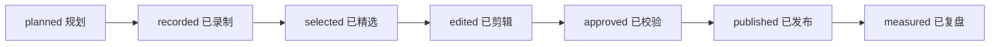

# SkillsHelper 镜头资产管理规范

## 目标

把“想拍什么、为何能拍、素材在哪里、能否发布”从分散的聊天记录和剪辑软件时间线中抽离出来，形成一个轻量的镜头管理系统。第一阶段不新建复杂软件：用版本化的 YAML 清单作为单一事实来源，用本仓库内的视频资产工作区管理二进制文件；验证稳定后再做可视化界面。

## 镜头管理软件：MVP 规划

产品暂定内部名为 **SkillsHelper Studio / 镜头台**，只服务推广团队，不与用户的技能工作台混在一起。

### MVP 的四个页面

| 页面 | 用户要完成的事 | 最小字段/动作 |
| --- | --- | --- |
| 镜头看板 | 知道每条内容做到哪一步 | 按 `planned → recorded → selected → edited → approved → published` 分列 |
| 镜头详情 | 录到可复核的真实画面 | 旁白、证据命令、期望画面、录制前提、录制注意、资产 ID |
| 素材库 | 追踪一个录屏被裁成哪些版本 | 原始文件、精选片段、剪辑工程、封面、各平台导出物的关联 |
| 发布与复盘 | 连接内容与结果 | 平台、标题/封面版本、发布时间、链接、48 小时与 7 天指标 |

### 明确不做

- 不在第一阶段做视频剪辑、云盘同步、自动发布或 AI 生成视频。
- 大视频文件可放在本工作区管理，但默认不提交到 Git；需要发布的轻量索引、说明和清单进入版本管理。
- 不把未经实测的数字写进旁白、封面或官网。

### 数据模型

```text
Campaign 1 ── N Shot ── N Asset
                  │        │
                  └── N Evidence
Campaign 1 ── N Publication ── N MetricSnapshot
```

- `Shot`：一次可独立录制和复用的画面单元；ID 形如 `SH-001`。
- `Evidence`：该镜头所宣称内容的命令、API 返回、界面状态或源码位置。
- `Asset`：真实文件的本机路径、时长、画幅、哈希与版权/授权状态。
- `Publication`：一次平台发布；一个镜头可以参与多个成片。
- `MetricSnapshot`：固定在发布后 48 小时与 7 天记录，禁止用实时数覆盖历史值。

## 目录与文件规范

### 1. 计划资料（仓库内）

| 类型 | 存放位置 | 格式 | 规则 |
| --- | --- | --- | --- |
| 镜头主清单 | `assets/shot-catalog.yaml` | YAML | 镜头 ID 不复用；每条必须有 `claim` 和 `evidence` |
| 字幕/旁白 | `assets/scripts/` | `.md`、`.srt` | 与镜头 ID、语言和版本对应 |
| 发布计划 | `campaigns/YYYY-QN-主题.md` | Markdown | 一份计划只负责一个周期 |
| 数据快照 | `metrics/YYYY-WW.md` | Markdown | 记录来源、抓取时间与指标窗口 |
| 历史口径 | `archive/` | Markdown | 只追加说明，不篡改历史证据 |

### 2. 二进制素材（仓库内工作区，默认不进 Git）

使用 `.hermes/plans/skillshelper-promotion/videos/`，让镜头清单、发布计划和视频素材在同一工作区管理。`.gitignore` 默认排除常见大视频和剪辑工程文件，只保留目录说明与轻量索引。

```text
.hermes/plans/skillshelper-promotion/videos/
├── 01-capture/YYYY-MM-DD/       # 原始录屏，只追加
├── 02-selects/CAMPAIGN-ID/      # 经挑选的可复用片段
├── 03-edit/CAMPAIGN-ID/         # CapCut/Final Cut/Resolve 工程
├── 04-export/PLATFORM/          # 发布文件
└── 05-cover/CAMPAIGN-ID/        # 封面原图、编辑源与导出图
```

文件名统一为：

```text
{campaign}_{shot}_{variant}_{ratio}_{date}_v{n}.{ext}
SHL-Q3_SH-004_demo_9x16_20260710_v01.mov
SHL-Q3_LAUNCH_zhihu-answer_16x9_20260710_v02.mp4
```

- `campaign`：`SHL-Q3`、`SHL-LAUNCH` 等稳定短码。
- `shot`：来自镜头清单的 `SH-001` 等；成片可用内容 ID，如 `LAUNCH-01`。
- `variant`：`raw`、`demo`、`clean`、`captioned`、`cover-a` 等。
- `ratio`：`9x16`、`16x9`、`1x1`；不要用含糊的 `final`、`latest`。
- 版本只递增；已发布文件永不覆盖。

## 工作流与关口



1. **规划**：新增镜头前，写清楚受众、单一主张、证据和失败替代方案。
2. **录制**：按镜头清单的命令和前提录屏；录制完成立即写入本机文件路径与时长。
3. **精选**：只保留无敏感信息、无启动失败、无临时数据误导的片段。
4. **剪辑**：用同一份镜头 ID 连接字幕、配音、封面和平台裁切版。
5. **校验**：逐字核查版本、数字、命令和 CTA；数据类声明必须在录制当日复核。
6. **发布与复盘**：登记链接、标题/封面版本；48 小时与 7 天写入指标快照。

## 录制安全清单

- 关闭通知、隐藏个人路径、Token、邮箱、浏览器书签和终端历史中的敏感信息。
- MCP 配置、环境变量和 API 响应只展示已脱敏字段。
- 录制前执行镜头对应的证据命令；数字不一致时改文案，不“修剪”证据。
- AI 生成的配音、转场或封面按目标平台规则显著标识；产品功能证据必须来自真实录屏。

## 迭代路线

| 阶段 | 交付 | 进入条件 |
| --- | --- | --- |
| P0（现在） | YAML 镜头清单 + 本规范 + 手动复盘 | 已能稳定录制 8 个核心镜头 |
| P1 | 只读 Web 看板：筛选、状态、证据与资产链接 | 连续 4 周按清单发布并记录数据 |
| P2 | 发布复盘表、标题/封面 A/B 对比 | 至少 12 条内容有可比指标 |
| P3 | 本地素材索引与缺失资产提醒 | 素材规模导致手工检索超过 10 分钟/次 |
