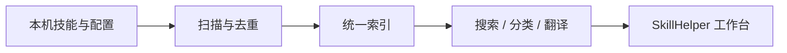

# SkillHelper

> 把散落在本机、编辑器、插件与 MCP 配置中的 AI 能力，整理成一个可搜索、可理解、可持续维护的工作台。

[](https://www.npmjs.com/package/skillhelper)
[](./LICENSE)
[](https://nodejs.org/)

**SkillHelper** 是产品对外名称。npm 包名和 CLI 命令当前使用可发布的小写形式 `skillhelper`。

## 不再靠记忆找技能

AI 工作流越来越复杂：技能文件散在不同编辑器里，插件与 MCP 配置各有入口，说明大多是英文，想确认“我到底装了什么、在哪、怎么用”往往要翻目录、查配置、切窗口。

SkillHelper 把这些本地能力汇总为一个清晰的面板：

- **发现**：扫描编辑器技能、个人技能库、插件、MCP 配置和项目运行手册。
- **整理**：按来源与三级结构归类，支持搜索、筛选、排序和分组。
- **理解**：保留原始内容，并为可翻译的说明提供中文对照；命令和代码块不被误译。
- **识别**：优先展示本机应用的真实图标，缺失时自动回退到清晰的标识。



## 适合谁

- 同时使用 Codex、Claude、Cursor、VS Code 等 AI 开发工具的人。
- 在维护个人技能库、插件和 MCP 服务，却缺少统一视图的人。
- 希望让本地 AI 工作流更可见、更可检索、更便于交接的开发者和工具作者。

## 60 秒上手

需要 Node.js 20 或更高版本。

```bash
npm install -g skillhelper@latest
skillhelper start
```

命令会扫描已配置的来源、在后台启动本地服务并打开浏览器。首次使用时，可先生成并调整扫描来源：

```bash
skillhelper init
# 编辑 ~/.config/skillhelper/sources.yaml
skillhelper restart
```

常用命令：

| 命令 | 用途 |
| --- | --- |
| `skillhelper start` | 扫描并启动本地工作台 |
| `skillhelper stats` | 查看扫描统计与来源概览 |
| `skillhelper scan` | 仅扫描并输出结构化数据 |
| `skillhelper sync` | 将当前技能同步到选定编辑器 |
| `skillhelper stop` | 停止后台服务 |

## 开发

```bash
git clone https://github.com/aquarkgn/SkillsHelper.git
cd SkillsHelper
npm install
npm run dev
```

`npm run dev` 会重启本地 API 并启动 Vite 开发服务器。常用校验：

```bash
npm test
npm run typecheck:web
npm run typecheck:site
npm run build:site
```

## 本地优先，也说明边界

- 扫描、索引、图标缓存和用户配置保存在本机；扫描器只读取已配置的文件来源。
- MCP 配置在进入展示层前会做敏感字段脱敏。
- 中文对照使用翻译服务时，需要网络连接；翻译结果会缓存在本地，避免重复请求。代码块和命令保持原样。

详细扫描范围、分级与图标降级规则见 [扫描技能规则](./docs/scan_skills_rules.md)。

## 项目结构

```text
packages/
├── scanner/  # 多来源扫描、去重、图标解析
├── server/   # Fastify API、翻译与缓存
├── web/      # 本地工作台
└── site/     # SkillHelper 对外介绍页
```

## 推广与产品资料

推广计划、镜头资产管理、发布素材规范和视频文件索引统一维护在 `.hermes/plans/skillhelper-promotion/`。这里的文档以“真实录屏为证据、AI 只辅助包装”为原则，并会随着版本发布更新。

## 贡献与许可

欢迎通过 [Issues](https://github.com/aquarkgn/SkillsHelper/issues) 提交问题或建议。项目采用 [MIT License](./LICENSE)。
