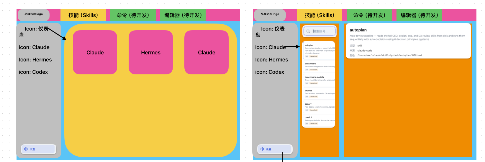
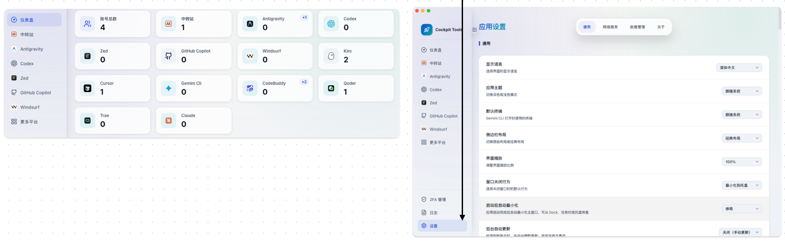

# 🎨 HuHaa-MySkills 前端主题设计系统 v2.0

> 完整的视觉设计系统、布局蓝图、配色方案、组件库规范
> 本版基于「新布局蓝图」与「Cockpit Tools 风格视觉参考」重写，取代 v1.0。

> ⚠️ **评审修订（2026-06-30，/plan-eng-review 锁定）**：
> - **导航/筛选轴 = `editor`（非 `brand`）**。`brand` 是内容推断的主题词（OpenAI/Cloudflare），`editor` 才是「Claude Code/Hermes Agent/Cursor/Codex」这一工具面，`Stats.byEditor` 已就绪。本文凡写「品牌轴/品牌色图标」处，实现时以 `editor` 为准。
> - **仪表盘统计卡 = 技能聚合指标**（`total/byKind/byEditor/bySource/byCategory/parseError`），复用卡片视觉但**不照搬**参考图的「账号数」语义。
> - 详见 [Frontend-Refactor-Plan.md §0 评审锁定决策](./Frontend-Refactor-Plan.md)。

---

## 0. 设计来源（参考图）

本设计系统的两份基准来自以下两张参考图，所有布局、配色、组件规范均以其为准。

### 0.1 布局蓝图（信息架构）



> 上半部为线框蓝图：**顶部模块标签栏**（品牌 logo · 技能 / 命令(待开发) / 编辑器(待开发)）+ **左侧图标导航栏**（仪表盘 / Claude / Hermes / Codex …，底部固定「设置」）+ **内容区**。内容区随选择在两种形态间切换：
> - **卡片网格**（仪表盘）：三栏卡片
> - **三段主从**（技能）：搜索栏 → 列表 → 详情面板（如示例展示 `autoplan` 的 类型 / 来源 / 路径）
>
> 下半部为已落地的真实界面截图，作为本蓝图的最终目标参照。

### 0.2 视觉参考（配色 / 主题 / 风格）



> 视觉风格关键词：**干净、浅色、柔和、留白充足**。
> - 画布为近白浅灰 + 点阵纹理；侧栏比画布更浅（近白）
> - 卡片为白底、圆角（~12px）、极淡描边 + 柔和投影
> - 每个平台卡片左侧为**品牌色方形图标**，右侧为标签 + 大号数字
> - 选中态用「柔和蓝底 + 蓝色文字 + 圆角胶囊」高亮
> - 设置页：左标题+副标题（灰）/ 右下拉选择，行间淡分隔线；右上分段标签页（通用 / 网络服务 / 数据管理 / 关于）

---

## I. 设计理念

### 核心价值
- **干净留白** — 大量留白、柔和投影、克制描边，信息密度适中
- **柔和现代** — 浅色基底 + 柔和蓝点缀，避免高饱和大色块
- **品牌可辨** — 平台/来源以品牌色图标标识，一眼可辨
- **一致性** — 统一的圆角、间距、卡片语言与状态色
- **可扩展** — CSS 变量主题系统，亮/暗双主题，易于定制

### 设计参考
- **桌面控制台风格** — Cockpit Tools 类应用：浅色、卡片化、图标导航
- **现代 SaaS** — Linear / Vercel 的留白与层级，但更柔和、更浅

---

## II. 配色系统

> 颜色以 **HSL 通道值**存储于 CSS 变量，配合 `tailwind.config.ts` 的 `hsl(var(--x) / <alpha-value>)` 使用（shadcn 约定）。落地于 `packages/web/src/index.css`。

### 亮色模式（Light — 默认）

| 颜色类型 | 16进制 | HSL 通道 | CSS 变量 | 用途 |
|---------|--------|---------|---------|------|
| **Background** | `#F7F8FA` | `220 20% 98%` | `--color-background` | 页面画布（点阵纹理底） |
| **Foreground** | `#1F2937` | `220 9% 12%` | `--color-foreground` | 正文 / 大号数字 |
| **Card** | `#FFFFFF` | `0 0% 100%` | `--color-card` | 卡片 / 面板底 |
| **Card-FG** | `#1F2937` | `220 9% 12%` | `--color-card-foreground` | 卡片内文本 |
| **Sidebar** | `#FBFCFD` | `210 20% 99%` | `--color-sidebar` | 左侧图标导航底 |
| **Border** | `#EDF0F3` | `220 16% 94%` | `--color-border` | 极淡描边 / 分隔线 |
| **Input** | `#F3F4F6` | `220 13% 96%` | `--color-input` | 搜索框 / 输入底 |
| **Ring** | `#3B82F6` | `215 100% 46%` | `--color-ring` | Focus 环 |
| **Primary** | `#3B82F6` | `215 100% 46%` | `--color-primary` | 主操作 / 选中文字 |
| **Primary-FG** | `#FFFFFF` | `0 0% 100%` | `--color-primary-foreground` | 主按钮文字 |
| **Primary-Soft** | `#EAF2FE` | `215 100% 96%` | `--color-primary-soft` | 选中态胶囊柔和底 |
| **Muted** | `#F1F3F5` | `220 13% 95%` | `--color-muted` | 二级面 / 悬停底 |
| **Muted-FG** | `#6B7280` | `217 11% 45%` | `--color-muted-foreground` | 副标题 / 说明文字 |
| **Accent** | `#F59E0B` | `38 92% 50%` | `--color-accent` | 高亮 / 提示（如 `+1` 角标） |
| **Destructive** | `#EF4444` | `0 84% 60%` | `--color-destructive` | 删除 / 危险操作 |

### 暗色模式（Dark）

| 颜色类型 | 16进制 | HSL 通道 | CSS 变量 | 用途 |
|---------|--------|---------|---------|------|
| **Background** | `#0F172A` | `222 47% 11%` | `--color-background` | 页面画布 |
| **Foreground** | `#F8FAFC` | `210 40% 96%` | `--color-foreground` | 正文 |
| **Card** | `#1A2336` | `217 33% 14%` | `--color-card` | 卡片 / 面板 |
| **Sidebar** | `#151D2E` | `222 33% 13%` | `--color-sidebar` | 左侧导航底 |
| **Border** | `#26324A` | `217 33% 20%` | `--color-border` | 描边 / 分隔 |
| **Primary** | `#3B82F6` | `215 100% 46%` | `--color-primary` | 主操作 |
| **Primary-Soft** | `#1E2A45` | `217 40% 20%` | `--color-primary-soft` | 选中态底 |
| **Muted-FG** | `#94A3B8` | `215 14% 65%` | `--color-muted-foreground` | 副标题 |
| **Accent** | `#F59E0B` | `38 92% 50%` | `--color-accent` | 高亮 |

### Editor 色图标（数据驱动，非主题 token）

导航/卡片左侧的方形圆角图标按 **`editor`**（owning tool surface）原生色着色，由 `Stats.byEditor` 数据映射，不进入主题 token。`brand`（OpenAI/Cloudflare 等主题词）仅用作列表项里的**次要徽章**，不做导航主轴：

| 平台 | 主色（参考） | 平台 | 主色（参考） |
|------|------------|------|------------|
| Claude / Anthropic | 珊瑚橙 `#D97757` | Codex / OpenAI | 墨黑 `#10A37F` |
| 中转站 (AK) | 橙 `#F97316` | Antigravity | 黑 `#111827` |
| Windsurf | 青 `#10B6C4` | Kiro | 紫 `#8B5CF6` |
| Cursor | 深灰 `#1F2937` | Gemini Cli | 蓝紫 `#4285F4` |
| CodeBuddy | 蓝 `#2563EB` | Qoder | 绿 `#22C55E` |
| GitHub Copilot | 灰黑 `#24292F` | Zed / Trae | 黑 `#0B0B0B` |

> 实现建议：维护一张 `editor → { label, color, icon }` 映射表（`src/lib/editors.ts`），含 unknown/缺失兜底；图标用其色 + `bg-{color}/10` 柔和底。过滤 `byEditor` 的 `(none)` 桶或标注「未分类」。

### CSS 变量实现（节选）

```css
:root {
  --color-background: 220 20% 98%;
  --color-foreground: 220 9% 12%;
  --color-card: 0 0% 100%;
  --color-sidebar: 210 20% 99%;
  --color-border: 220 16% 94%;
  --color-primary: 215 100% 46%;
  --color-primary-soft: 215 100% 96%;
  --color-muted-foreground: 217 11% 45%;
  --color-accent: 38 92% 50%;
}
.dark {
  --color-background: 222 47% 11%;
  --color-sidebar: 222 33% 13%;
  --color-primary-soft: 217 40% 20%;
  /* … 其余见 index.css */
}
```

### 画布点阵纹理（可选）

参考图画布带细点阵。用 `radial-gradient` 实现，仅作用于主内容画布：

```css
.canvas-dotted {
  background-color: hsl(var(--color-background));
  background-image: radial-gradient(hsl(var(--color-border)) 1px, transparent 1px);
  background-size: 20px 20px;
}
```

---

## III. 字体系统

```css
--font-sans: -apple-system, BlinkMacSystemFont, 'Segoe UI', 'Roboto', 'Oxygen',
  'Ubuntu', 'Cantarell', 'Fira Sans', 'Droid Sans', 'Helvetica Neue', sans-serif;
--font-mono: 'SF Mono', 'JetBrains Mono', 'Fira Code', Menlo, Consolas, monospace;
```

| 级别 | 字号 | 行高 | 字重 | 用途 |
|------|------|------|------|------|
| **H1** | 32px | 40px | 700 | 页面标题（如「应用设置」） |
| **H2** | 28px | 36px | 700 | 板块标题 |
| **H3** | 24px | 32px | 600 | 小节标题 / 详情标题 |
| **H4** | 20px | 28px | 600 | 卡片标题 |
| **Stat** | 28–32px | — | 700 | 统计卡大号数字 |
| **Body** | 16px | 24px | 400 | 正文 |
| **Body-sm** | 14px | 20px | 400 | 列表项 / 设置项标题 |
| **Caption** | 12px | 18px | 400 | 副标题 / 角标 / 路径 |
| **Code** | 14px | 20px | 500 (mono) | 路径 / 代码 |

> 已在 `tailwind.config.ts` 的 `fontSize` 扩展中定义 `h1/h2/h3/h4/body/body-sm/caption`。

---

## IV. 间距系统

基于 **4px 网格**（Tailwind 内置）。

| 值 | 用途 |
|-----|------|
| **px-3 py-2** | 导航项 / 列表项内间距 |
| **gap-4** | 卡片网格间距 |
| **p-5 / p-6** | 卡片 / 面板内容区 |
| **px-6** | 顶栏 / 内容区水平内边距 |
| **gap-2** | 图标与文字间距 |

---

## V. 圆角系统

```ts
// tailwind.config.ts
borderRadius: { lg: '12px', md: '8px', sm: '4px' }
```

| 半径 | 用途 |
|------|------|
| **rounded-lg (12px)** | 卡片、详情面板、统计卡、品牌图标 |
| **rounded-md (8px)** | 按钮、输入框、导航胶囊 |
| **rounded-sm (4px)** | 标签、徽章、角标 |
| **rounded-full** | 分段标签页选中胶囊 / 头像 |

---

## VI. 阴影系统

参考图整体投影**很轻**，以「浮起感」为度，避免重阴影。

```
shadow-sm   // 卡片默认（柔和浮起）
shadow      // 悬停 / 选中卡片
shadow-md   // 下拉菜单 / 弹层
shadow-lg   // 模态框
```

层级：`0 扁平` → `sm 卡片` → `md 浮层` → `lg 顶层`。

---

## VII. 布局规范（核心）

整体为「**顶部模块标签栏 + 左侧图标导航栏 + 内容区**」三区结构。

```
┌──────────────────────────────────────────────────────────┐
│ [Logo]   技能(Skills)   命令(待开发)   编辑器(待开发)        │ ← 顶部模块标签栏 (topbar)
├──────────┬───────────────────────────────────────────────┤
│ ◎ 仪表盘  │                                               │
│ ◍ Claude  │              内容区 (main)                     │
│ ◍ Hermes  │   · 仪表盘 → 卡片网格                          │
│ ◍ Codex   │   · 技能   → 搜索栏 + 列表 + 详情面板           │ ← 左侧栏 (sidebar)
│           │   · 设置   → 分页设置                           │
│ ⚙ 设置    │                                               │ ← 设置固定底部
└──────────┴───────────────────────────────────────────────┘
```

### 7.1 顶部模块标签栏（topbar）

- 左：品牌 logo + 名称
- 中/左：模块标签 `技能(Skills)` / `命令(待开发)` / `编辑器(待开发)`
- 选中态：高亮底（参考蓝图配色），未开发模块带「待开发」灰字 + 禁用样式
- 高度 56px

### 7.2 左侧图标导航栏（sidebar）

- 图标 + 文字的纵向导航项：`仪表盘`、按 `editor` 数据驱动（`Claude Code`/`Hermes Agent`/`Cursor`/`Codex`…，过滤 `(none)`）
- 选中态：`bg-primary-soft` + `text-primary` 圆角胶囊
- 悬停态：`hover:bg-muted`
- **底部固定**：`设置` 项（`mt-auto` 推到底部）
- 宽度 280px，底为 `--color-sidebar`

### 7.3 内容区（main）三态

| 模块/选择 | 形态 | 说明 |
|-----------|------|------|
| **仪表盘** | 卡片网格 | 响应式 grid（`grid-cols-1 md:grid-cols-2 lg:grid-cols-4`），每卡 = editor 图标 + 标签 + **技能聚合数字**（byKind/byEditor/parseError 等，非账号数）（+ 可选角标） |
| **技能** | 三段主从 | ① 顶部搜索栏；② 中部列表（项=名称+描述+来源标签）；③ 右侧详情面板（标题/描述/类型/来源/路径） |
| **设置** | 分页设置 | 右上分段标签页（通用/网络服务/数据管理/关于）+ 设置项行 |

> **布局约束（务必遵守）**：`build/verify.mjs` 的 CSS 冒烟断言引用 `sidebar` / `topbar` / `detail` 类名，以及 `index.html` 含 `<div id="app"></div>`。重命名这些类名需同步修改 `verify.mjs`。

---

## VIII. 组件设计规范

### 统计卡（StatCard，仪表盘）

```tsx
<Card className="flex items-center gap-3 p-5 rounded-lg shadow-sm">
  <span className="grid h-10 w-10 place-items-center rounded-lg" style={{ background: editor.color + '1A', color: editor.color }}>
    <BrandIcon size={20} />
  </span>
  <div>
    <p className="text-body-sm text-muted-foreground">{label}</p>
    <p className="text-h3 font-bold tabular-nums">{count}</p>
  </div>
  {delta && <span className="ml-auto rounded-sm bg-accent/15 px-1.5 text-caption text-accent">+{delta}</span>}
</Card>
```

### 搜索栏（技能模块顶部）

```tsx
<input
  type="search"
  placeholder="搜索账号 / 技能…"
  className="h-10 w-full rounded-md border border-border bg-input px-3 text-body-sm
             placeholder:text-muted-foreground
             focus-visible:outline-none focus-visible:ring-2 focus-visible:ring-ring"
/>
```

### 列表项（SkillListItem）

```tsx
<button className={cn(
  'flex w-full flex-col gap-1 rounded-md border border-border bg-card p-3 text-left transition-colors',
  selected ? 'border-primary bg-primary-soft' : 'hover:bg-muted'
)}>
  <span className="text-body-sm font-medium text-foreground">{name}</span>
  <span className="line-clamp-2 text-caption text-muted-foreground">{description}</span>
  <span className="mt-1 w-fit rounded-sm bg-muted px-1.5 py-0.5 text-caption text-muted-foreground">{source}</span>
</button>
```

### 详情面板（detail）

```tsx
<section className="detail">
  <h2 className="text-h3 text-foreground">{title}</h2>
  <p className="mt-2 text-body-sm text-muted-foreground">{description}</p>
  <dl className="mt-4 grid grid-cols-[auto_1fr] gap-x-4 gap-y-2 text-body-sm">
    <dt className="text-muted-foreground">类型</dt><dd>{kind}</dd>
    <dt className="text-muted-foreground">来源</dt><dd>{source}</dd>
    <dt className="text-muted-foreground">路径</dt>
    <dd className="break-all font-mono text-caption">{path}</dd>
  </dl>
</section>
```

### 设置项行（SettingRow）+ 分段标签页

```tsx
{/* 分段标签页 */}
<div className="inline-flex rounded-md bg-muted p-1 text-body-sm">
  {tabs.map(t => (
    <button className={cn('rounded-sm px-3 py-1', active === t && 'bg-card text-primary shadow-sm')}>{t}</button>
  ))}
</div>

{/* 设置项行 */}
<div className="flex items-center justify-between border-b border-border py-4">
  <div>
    <p className="text-body-sm text-foreground">{title}</p>
    <p className="text-caption text-muted-foreground">{subtitle}</p>
  </div>
  <Select value={value} options={options} />
</div>
```

### 待开发占位（命令 / 编辑器模块）

```tsx
<div className="grid h-full place-items-center text-muted-foreground">
  <div className="text-center">
    <p className="text-h4">{moduleName}</p>
    <p className="text-body-sm">待开发，敬请期待</p>
  </div>
</div>
```

---

## IX. 响应式设计

| 前缀 | 宽度 | 行为 |
|------|------|------|
| **sm** | 640px | 卡片网格 1 列 |
| **md** | 768px | 卡片网格 2 列；技能三段可折叠详情为抽屉 |
| **lg** | 1024px | 卡片网格 4 列；技能列表+详情并列 |
| **xl** | 1280px | 内容区最大化 |

```tsx
<div className="grid grid-cols-1 gap-4 md:grid-cols-2 lg:grid-cols-4">{/* 统计卡 */}</div>
```

---

## X. 动画系统

```ts
animation: {
  'fade-in': 'fadeIn 200ms ease-in',
  'slide-up': 'slideUp 300ms ease-out',
}
```

| 类型 | 时长 |
|------|------|
| 微交互（hover/选中） | 150–200ms |
| 模块/页面切换 | 300ms |
| Toast / 弹层 | 300ms |

---

## XI. 深浅主题切换

```ts
// src/hooks/useTheme.ts（已实现）
document.documentElement.classList.toggle('dark', next === 'dark')
localStorage.setItem('theme', next)
```

`index.html` 内联防闪烁脚本在首屏前读取 `localStorage.theme` 应用 `.dark`。

---

## XII. 无障碍性（A11y · WCAG AA）

- 色彩对比度 ≥ 4.5:1（正文）、≥ 3:1（大文本与图标）
- 所有导航/标签/设置项为可聚焦交互元素，`:focus-visible` 可见环（`--color-ring`）
- 键盘可达：模块标签、侧栏、列表、设置下拉
- 语义化：`<nav>` / `<aside>` / `<button>` / `<dl>`，图标按钮带 `aria-label`

---

## XIII. 与代码的映射

| 设计项 | 落地位置 |
|--------|---------|
| 颜色 token（CSS 变量） | `packages/web/src/index.css` |
| Tailwind 颜色/字号/圆角 | `packages/web/tailwind.config.ts` |
| 三区布局类（sidebar/topbar/detail/main-pane） | `packages/web/src/index.css`（`@layer components`） |
| 主题切换 | `packages/web/src/hooks/useTheme.ts` |
| editor 色映射 | `packages/web/src/lib/editors.ts`（待新增，含兜底） |
| verify 断言约束 | `build/verify.mjs`（`#app`；CSS 子串 OR 含 `topbar`/`sidebar`/`detail` 任一 — 重构后应升级为断言新结构） |

---

## XIV. 版本管理

- **版本** — v2.0（基于新布局蓝图 + Cockpit Tools 视觉参考重写）
- **更新日期** — 2026-06-30
- **取代** — v1.0（Vercel/Linear 风格）
- **审核规则** — 主题/布局变更需 PR 审查通过；改动 `sidebar/topbar/detail` 类名须同步 `build/verify.mjs`

---

**下一步**：见 [Frontend-Refactor-Plan.md](./Frontend-Refactor-Plan.md)（按本设计系统推进的分阶段重构计划）。
